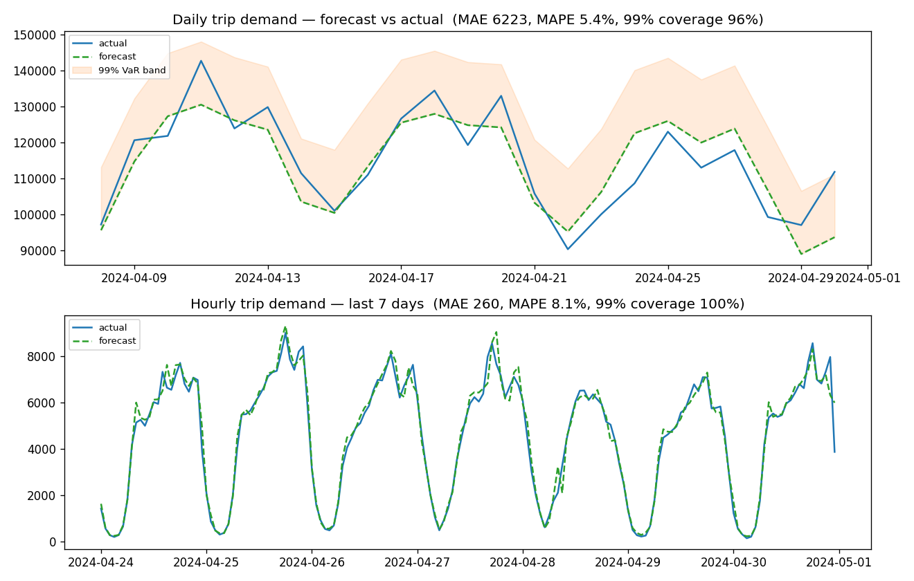

# AI Platform — Cloud-Native Infrastructure for Production ML & LLM Workloads

> A Kubernetes-native platform for running AI workloads end to end: a
> framework-neutral model registry + self-service deployment API, CPU **and** GPU
> serving (LightGBM and vLLM), distributed training, inference benchmarking,
> FinOps, and full observability/security — demonstrated on a real workload (NYC
> yellow-taxi demand forecasting, leakage-free with calibrated risk bands) plus an
> LLM operations copilot grounded in that workload's own forecast + monitoring data.

<p>
<a href="https://github.com/hastikacheddy/nyc-taxi-demand-forecasting/actions/workflows/mlops_pipeline.yaml"></a>


</p>

This is not a notebook with a `model.pkl`. It is the surrounding **operational
system** — the 90% of ML work that happens after the model trains — built on real
data and graded against an MLOps maturity framework.

---

## Contents
- [AI Platform layer](#ai-platform-layer) · [Results](#results) · [What makes it production-grade](#what-makes-this-production-grade-not-a-notebook) · [Architecture](#architecture)
- [Capabilities](#capabilities) · [Engineering decisions](#engineering-decisions-worth-calling-out) · [Quickstart](#quickstart) · [Repo layout](#repository-layout)

---

## AI Platform layer

Beyond serving one model well, the repo now includes an **internal AI platform
abstraction** — one framework-neutral control plane that registers, deploys, and
serves *any* model (a CPU LightGBM forecaster **and** a GPU-served LLM) through the
same API, scheduler, and observability. This is the layer a platform team runs
internally on top of Vertex AI / SageMaker / Databricks Model Serving.

```
 Developers → Internal AI Platform API  (src/platform/gateway.py)
                    │  /v1/models  /v1/deployments  /v1/inference  /v1/costs
        ┌───────────┴───────────┐
   Model Registry         Deployment Manager  ── canary · fallback · pool placement
  (framework-neutral)            │ build_backend()
                         ┌───────┴────────┐
                   LightGBM (CPU)     vLLM / LLM (GPU)
                         └──── KServe · GPU pools · autoscale ────┘
              Observability · FinOps · Reliability · Multi-tenancy
```

**Eight infrastructure capabilities, each runnable and tested:**

| Gap | What was built | Where |
|---|---|---|
| **Platform APIs** | Register / deploy / infer / cost control plane + **declarative `workload.yaml`** (any workload → CPU/GPU pool) | [`src/platform/`](src/platform/) · [ARCHITECTURE](docs/platform/ARCHITECTURE.md) |
| **K8s-native serving** | KServe `InferenceService` (CPU + vLLM GPU), canary, autoscale | [`kubernetes/serving/`](kubernetes/serving/) |
| **LLM serving** | vLLM backend (OpenAI-compatible), GPU pool | [`backends.py`](src/platform/backends.py) · [ADR-002](docs/adr/002-why-vllm.md) |
| **GPU infrastructure** | Taints/tolerations, node affinity, quotas, priority classes | [`gpu-*.yaml`](kubernetes/serving/) · [GPU_DESIGN](docs/platform/GPU_DESIGN.md) |
| **Inference optimization** | p50/p95/p99 + throughput + GPU-util, **and TTFT + tokens/sec** for streaming LLMs | [`benchmarks/`](benchmarks/) |
| **Distributed compute** | Data-parallel trainer + PyTorch DDP + Ray Train (checkpoint/recovery, 5 tests) | [`src/training/distributed/`](src/training/distributed/) |
| **Reliability + multi-tenancy** | Failure catalogue, degradation ladders, canary fallback, GPU quotas | [RELIABILITY](docs/platform/RELIABILITY.md) |
| **Cloud architecture** | Azure AKS + GPU pool + ACR + Blob + Key Vault + Monitor (Terraform, `validate` passes) | [`infra/azure/`](infra/azure/) · [ADR-001](docs/adr/001-why-kubernetes.md) |

Plus **FinOps** (cost/request, cost/model, idle-GPU detection — [`finops.py`](src/platform/finops.py), [COST_MODEL](docs/platform/COST_MODEL.md)) and a
full **LLMOps** layer (prompt registry, guardrails, embeddings, vector store, RAG,
eval — [`src/llmops/`](src/llmops/)) including a **Taxi Ops Copilot** that answers
operator questions grounded in the forecasting workload's own demand data
([`ops_copilot.py`](src/llmops/ops_copilot.py)). Design decisions are recorded as
[Architecture Decision Records](docs/adr/) and a full [reliability](docs/platform/RELIABILITY.md) /
[scaling](docs/platform/SCALING.md) / [DR](docs/platform/DISASTER_RECOVERY.md) design-doc set.

> **Honesty ledger:** the platform control plane, backends, canary/fallback,
> benchmark, FinOps, distributed trainer, and LLMOps all **run and are tested**
> here; the GPU node pools and A100s are **designed as IaC + manifests**, not
> provisioned. Nothing pretends to own hardware it doesn't. See
> [ARCHITECTURE §5](docs/platform/ARCHITECTURE.md).

---

## Results

Out-of-sample evaluation on **~13M real trips** across 4 months of 2024 TLC
yellow-taxi data, aggregated to per-period demand. Scoring uses a strict
chronological **80/20 split** — the model never sees the held-out tail it is
graded on. Reproduce end to end with `python scripts/evaluate.py`.

| Model  | Test window | MAE | MAPE | 99% interval coverage |
|--------|-------------|----:|-----:|----------------------:|
| **Daily**  | 23 days        | ~6,200 trips | **5.4 %** | 95.7 % |
| **Hourly** | 24 days (576 h) | ~260 trips   | **8.1 %** | 100 % |

The 99% Value-at-Risk band is **calibrated** — empirical coverage lands at/above
the 99% target without being absurdly wide (the daily band sits ~12–15% above the
point forecast). Next-step production forecast for `2024-05-01`: **117,078
trips/day** (99% capacity target 134,564); peak-hour target **2,592 trips/h**.



*Top — daily demand: the point forecast (dashed) tracks actuals inside the 99% VaR
band. Bottom — hourly demand over the last 7 test days: the model captures the full
commuter rhythm (overnight trough, AM/PM peaks) with ~8% error.*

---

## What makes this *production-grade*, not a notebook

The single most important engineering decision in the repo, and the one I'd lead
with:

> **The original notebook model was a *nowcast*, not a forecast — and I caught it.**

The notebook's features include `LagDelta = Volume − Lag_n`, which contains the
*current* period's value. That produces a beautiful in-sample MAE (~13) but is
**data leakage**: the model can only "predict" a period whose actual is already
known. A naïve port would have shipped a model that looks excellent in a demo and
is useless in production.

Instead I built a separate, **leakage-free forecaster**
([`src/forecasting/forecaster.py`](src/forecasting/forecaster.py)) whose every
feature for target period *t* is computed strictly from data **before** *t*
(`Lag1`, seasonal lag, *past-only* momentum and rolling stats, plus calendar
features known in advance). Re-scored honestly out-of-sample, that's the **5.4%
daily MAPE** above — a number you can actually trust in production. The original
notebook logic is preserved untouched; the forecaster is additive.

This is the difference between *"I trained a model"* and *"I understand why a
model fails in production."*

---

## Architecture

```
 TLC trip records (public Parquet, ~13M rows)
      │  data_cleaning_dag  (@daily)
      ▼  sensor → ingest+clean (UTC, drop invalid/out-of-range) → pandera gate
 data/{daily,hourly}_demand.csv   (per-period trip counts, DVC-tracked)
      │
      ├─►  weekly_training_dag  (@weekly)
      │      validate → train LightGBM → GARCH σ → CHAMPION-CHALLENGER gate
      │      → MLflow registry @champion   (+ model card, SHA-256 integrity tag)
      │
      ├─►  daily / hourly_inference_dag
      │      sensor → forecast_next → 99% VaR band → shadow_log (idempotent upsert)
      │
      └─►  monitoring_dag  (@daily)
             join matured forecasts to actuals → realised MAE & coverage
             → on concept drift, TRIGGER retraining          ← closed loop
                                   │
 Serving API (FastAPI) ───────────┘  loads @champion, /predict + /metrics
      │   API-key auth · rate-limited · Prometheus telemetry · anomaly guard
      ▼
 Kubernetes (non-root, read-only FS, HPA 2→6) · MinIO/S3 artifacts · Prometheus+Grafana
```

> **One mental model carries the whole repo: _Airflow conducts; `src/` plays._**
> The DAGs only decide *when* and *in what order*. The real logic lives in `src/`
> and runs identically with or without Airflow — which is exactly why **109 tests**
> can exercise it directly.

See **[ARCHITECTURE_AND_HANDOVER.md](ARCHITECTURE_AND_HANDOVER.md)** for the full
design, every safety guardrail (and *why* it exists), and the ops runbook.

---

## Capabilities

### 🧠 Modelling & uncertainty
| What | Where |
|---|---|
| Leakage-free 1-step LightGBM forecaster (daily + hourly) | [`forecasting/forecaster.py`](src/forecasting/forecaster.py) |
| **GARCH(1,1) + 10k-sim Monte-Carlo Value-at-Risk** for calibrated 99% buffers | [`inference/risk.py`](src/inference/risk.py) |
| **Hour-of-day conditional σ** — wide at rush hour, floored overnight (heteroscedasticity the single GARCH σ misses) | [`inference/risk.py`](src/inference/risk.py) |
| Reproducible out-of-sample evaluation harness + chart | [`scripts/evaluate.py`](scripts/evaluate.py) |

### 🔁 MLOps lifecycle
| What | Where |
|---|---|
| MLflow registry with **champion-challenger promotion gate** — a retrain only goes live if its holdout MAE *beats* the incumbent; otherwise it's parked as `@challenger` | [`common/promotion.py`](src/common/promotion.py) |
| **Closed drift loop** — joins matured forecasts to actuals, flags concept drift at +15% realised MAE, auto-triggers retraining | [`monitoring/scoring.py`](src/monitoring/scoring.py) |
| Evidently drift detection on feature distributions | [`monitoring/drift_detector.py`](src/monitoring/drift_detector.py) |
| Feast feature store (offline → online materialization) | [`feature_repo/`](feature_repo/) |
| Model cards / governance metadata logged per version | [`governance/cards.py`](src/governance/cards.py) |
| DVC data versioning | [`.dvc/`](.dvc/) |

### 🛰️ Orchestration (Airflow)
Five DAGs with **enterprise guardrails**: idempotent tasks bounded by the
execution date (safe backfills/retries), `KubernetesPodOperator` compute
isolation, **reschedule-mode sensors** (no held worker slots), concurrency pools +
`max_active_runs=1`, and exponential-backoff retries. The orchestration-free task
logic lives in [`src/pipelines/`](src/pipelines/) and is validated by a DagBag
suite in [`testing/`](testing/).

### 🚀 Serving & deployment
| What | Where |
|---|---|
| FastAPI service sharing the **exact** batch forecast code path (API & DAGs give identical forecasts) | [`serving/api.py`](src/serving/api.py) |
| API-key auth (constant-time compare), **60 req/min rate limit** (model-extraction defence), audit log with hashed request IDs, OpenAPI disabled in prod, anomaly guard on outputs | [`serving/api.py`](src/serving/api.py) |
| Hardened Kubernetes: non-root, `readOnlyRootFilesystem`, drop **ALL** caps, seccomp `RuntimeDefault`, no SA token, **HPA 2→6 @70% CPU** | [`kubernetes/`](kubernetes/) |
| OPA/Rego admission policy enforcing the pod least-privilege baseline | [`kubernetes/opa-policy.rego`](kubernetes/opa-policy.rego) |
| Locust load-test profile | [`loadtest/`](loadtest/) |

### 🔐 Security & supply chain
| What | Where |
|---|---|
| **6-stage CI/CD**: lint → code-review → tests(+cov gate) → data-quality → smoke-train → supply-chain → image build | [`.github/workflows/`](.github/workflows/mlops_pipeline.yaml) |
| Static analysis: **Bandit + Semgrep** (custom architecture rules) gate the build | [`.semgrep/rules.yml`](.semgrep/rules.yml) |
| **SBOM/AI-BOM** (CycloneDX), dependency CVE scan (pip-audit), **Trivy** image scan (fails on CRITICAL), **cosign** image signing | CI workflow |
| **Model-artifact integrity** — SHA-256 verified before load (defends against tampered pickles executing on deserialization) | [`inference/model_integrity.py`](src/inference/model_integrity.py) |
| PII scanner + pandera data-quality gates on every batch | [`data/pii.py`](src/data/pii.py), [`data/quality_gate.py`](src/data/quality_gate.py) |

### 📈 Observability & ops
Prometheus + Grafana dashboards (request rate, latency histograms, drift metrics
via statsd-exporter), automated infra-state **backup/restore** scripts, and a full
handover runbook. See [`observability/`](observability/).

---

## Engineering decisions worth calling out

- **Caught data leakage** that would have shipped a fake-good model, and fixed it
  without discarding the original analysis ([story above](#what-makes-this-production-grade-not-a-notebook)).
- **Risk as a first-class output, not an afterthought.** Capacity planning needs a
  *bound*, not a point estimate — so the system serves a calibrated 99% VaR buffer,
  validated by empirical coverage, with per-hour volatility.
- **A promotion gate that can say no.** Continuous training is dangerous without
  one: a bad retrain silently degrades prod. Here a new model must *earn* `@champion`.
- **The serving API and the batch DAGs run the same forecasting code** — no
  train/serve skew by construction.
- **Security treated as part of "done"**: least-privilege pods, signed & scanned
  images, artifact-integrity checks, rate limiting, secrets via env/secret-refs only.

---

## Quickstart

```bash
pip install -r requirements.txt
pip install -e .

# Fetch public TLC data and build the raw events file (~200 MB download)
python scripts/download_data.py --start 2024-01 --end 2024-04

# Run the whole pipeline end-to-end (ingest → train → forecast), no Airflow needed
python run_pipeline.py

# Reproduce the out-of-sample evaluation + chart
python scripts/evaluate.py

# Tests (149 unit + integration)
pytest tests/ testing/

# ── AI Platform layer ──────────────────────────────────────────────
# Run the internal platform API (register → deploy → infer → costs)
uvicorn src.platform.gateway:app --port 8090      # then POST /v1/models, /v1/deployments, /v1/inference

# Inference-optimization benchmark (zero-dep self-demo: vLLM vs vanilla HF)
python -m benchmarks.run_benchmark --demo

# Distributed training (dep-free data-parallel: shard → all-reduce → checkpoint → recover)
python -m src.training.distributed.data_parallel_demo

# Validate the Azure infra
cd infra/azure && terraform init -backend=false && terraform validate

# Inspect the DAGs in a real Airflow UI (Docker)
docker compose -f docker-compose.airflow.yml up -d --build   # http://localhost:8088
```
> The small aggregated `data/*_demand.csv` are committed so the repo runs out of
> the box; the large raw Parquet is fetched by the download script (git-ignored).

---

## Repository layout
| Path | What |
|---|---|
| [`src/platform/`](src/platform/) | **AI platform control plane** — registry, deployments, backends, gateway, FinOps |
| [`src/llmops/`](src/llmops/) | **LLMOps** — prompt registry, guardrails, embeddings, vector store, RAG, eval |
| [`src/training/distributed/`](src/training/distributed/) | data-parallel trainer + PyTorch DDP + Ray Train (checkpoint/recovery) |
| [`benchmarks/`](benchmarks/) | inference-optimization harness (p50/p95/p99, throughput, GPU util) |
| [`kubernetes/serving/`](kubernetes/serving/) | KServe (CPU + vLLM GPU) + GPU scheduling (taints, quotas, priorities) |
| [`infra/azure/`](infra/azure/) | Azure AKS + GPU pool + ACR + Blob + Key Vault Terraform |
| [`docs/platform/`](docs/platform/), [`docs/adr/`](docs/adr/) | Platform design docs (GPU/reliability/scaling/cost/DR/security) + ADRs |
| [`src/forecasting/`](src/forecasting/) | leakage-free forecaster, training, serving engine, VaR |
| [`src/inference/`](src/inference/) | risk/VaR, input validation, model-integrity guard |
| [`src/pipelines/`](src/pipelines/) | idempotent DAG task logic (Airflow-free, fully testable) |
| [`src/orchestration/`](src/orchestration/) | Airflow operator factory (compute isolation, retries) |
| [`src/monitoring/`](src/monitoring/) | drift loop + scoring against actuals |
| [`src/serving/`](src/serving/) | FastAPI app (auth, rate limit, metrics) |
| [`src/data/`](src/data/), [`src/features/`](src/features/), [`src/governance/`](src/governance/) | ingestion, Feast features, model cards |
| [`dags/`](dags/), [`testing/`](testing/) | thin Airflow DAGs + DagBag validation suite |
| [`kubernetes/`](kubernetes/), [`docker/`](docker/) | hardened deploy manifests + images |
| [`observability/`](observability/) | Prometheus + Grafana stack |
| [`tests/`](tests/) | 109 unit/integration tests incl. adversarial cases |

---

## Tech stack
`Python 3.11 · LightGBM · GARCH/arch · Apache Airflow · MLflow · Feast · Evidently ·
FastAPI · Docker · Kubernetes · KServe · vLLM · Ray Train · PyTorch DDP · Terraform
(Azure AKS) · MinIO/S3 · Prometheus · Grafana · pandera · DVC · GitHub Actions ·
Bandit · Semgrep · Trivy · cosign · CycloneDX`

## Data & license
Trip data: **NYC TLC open data** (public). Image paths (`ghcr.io/your-username/…`)
and infra endpoints are placeholders — set them for your own environment. Code
licensed under **MIT** — see [LICENSE](LICENSE).
