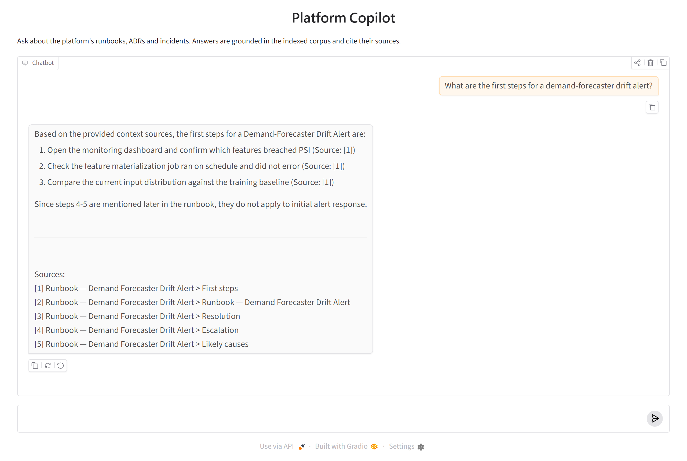
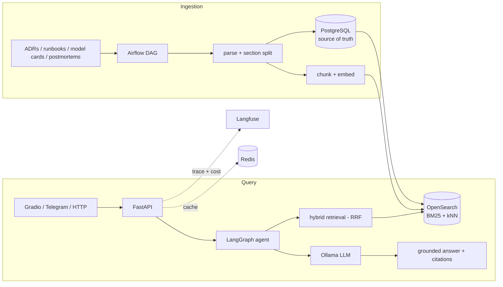
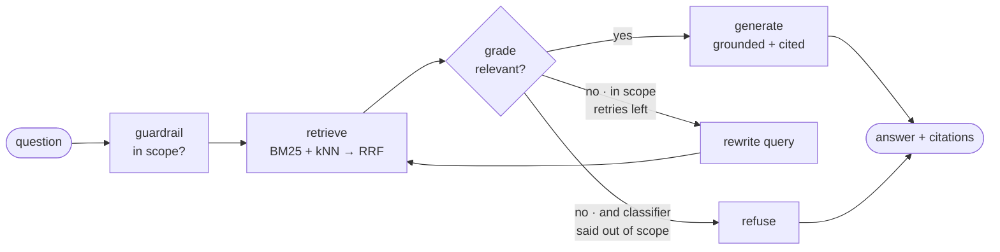
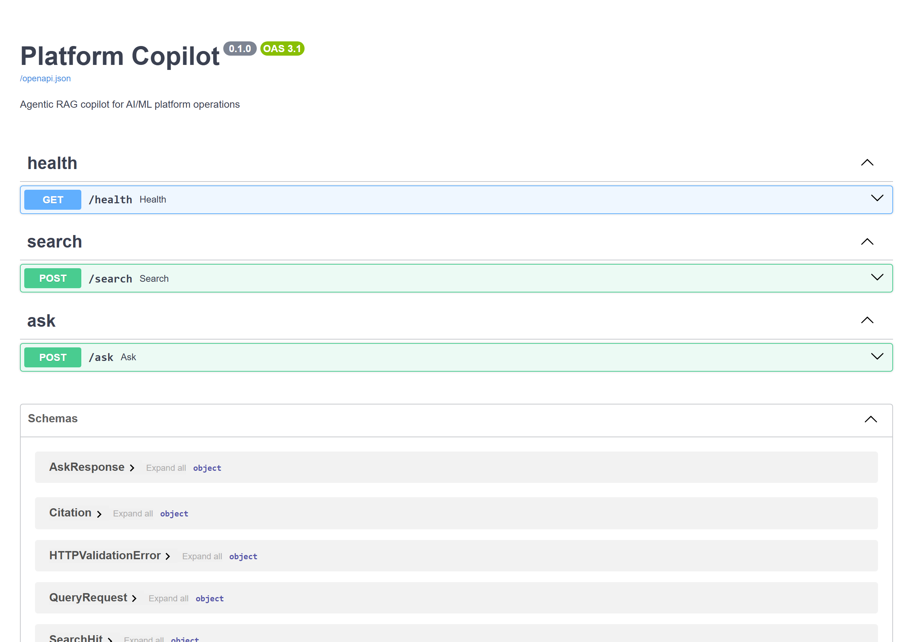

# Platform Copilot

**An agentic RAG service that answers operational questions about an AI/ML platform —
grounded in its own runbooks, ADRs and incident postmortems, and citing every claim.**

<p>


</p>



Ask *"What are the first steps for a demand-forecaster drift alert?"* and you get the actual
steps from the actual runbook, each line citing the section it came from — not a
plausible-sounding guess. When the corpus doesn't cover the question, it says so.

A service inside [`ai-workload-platform`](../README.md); it answers questions about the
platform it runs alongside.

---

## Contents

- [Why this exists](#why-this-exists) · [Architecture](#architecture) · [The agent loop](#the-agent-loop)
- [Interfaces](#interfaces) · [Quickstart](#quickstart) · [Verified end to end](#verified-end-to-end)
- [Design decisions](#design-decisions) · [Repository layout](#repository-layout) · [Status](#status--what-runs-and-what-does-not)

---

## Why this exists

Operational knowledge lives scattered across ADRs, runbooks, model cards and postmortems.
On-call engineers and new joiners burn hours hunting through it. This service turns that
corpus into a **queryable, cited, low-latency assistant** — and treats the production
concerns (retrieval quality, observability, cost, caching, guardrails, evaluation) as
first-class rather than as afterthoughts.

The design deliberately builds a **strong keyword baseline first**, then layers semantic and
agentic capability on top only where it measurably helps.

---

## Architecture



Requests are layered **`Observed → Cached → Agent/RAG`**: every call is timed and traced, an
identical question skips retrieval *and* the LLM entirely, and only a cache miss reaches the
model. Postgres owns truth; OpenSearch is a derived index that can be rebuilt from it.

---

## The agent loop



**Scope is corroborated, not trusted.** Running this against a real model exposed the flaw in
the obvious design: a small classifier doesn't know that "promotion gate" is platform jargon,
so it refused perfectly valid questions. The agent now refuses **only when the classifier says
no *and* retrieval found nothing relevant** — the corpus defines the scope, not the model's
world knowledge. An unparseable verdict fails *open*, because a wrongly-refused operational
question is far worse than an off-topic one slipping through.

The agent costs ~3 LLM round-trips (~38s vs ~10s single-shot on a CPU-only 1B model).
Set `USE_AGENT=false` for the single-shot RAG path.

---

## Interfaces

| Surface | Entry point |
|---|---|
| **HTTP API** | `GET /health` · `POST /search` · `POST /ask` |
| **Chat UI** | `python scripts/ui.py` → <http://127.0.0.1:7861> |
| **On-call bot** | `python scripts/telegram_bot.py` (needs a bot token) |
| **CLI** | `python scripts/ask.py "question"` · `python scripts/ingest.py` |



---

## Quickstart

```bash
# 1. Data plane (Postgres, OpenSearch, Redis)
docker compose up -d

# 2. A local model
ollama pull llama3.2

# 3. Install + ingest + ask
pip install -e ".[agent]"
cp .env.example .env
python scripts/ingest.py
python scripts/ask.py "What are the first steps for a drift alert?"

# 4. Serve
uvicorn platform_copilot.main:app --reload      # API + /docs
python scripts/ui.py                            # Gradio chat UI
```

Offline test suite (no Docker, no model required):

```bash
pytest -q      # 40 passed
```

---

## Verified end to end

Not a claim — the actual output of `POST /ask` against live OpenSearch + Ollama:

```text
ANSWER:
Here are the first steps for a Demand-Forecaster Drift Alert:
1. Open the monitoring dashboard and confirm which features breached PSI [1].
2. Check the feature materialization job ran on schedule and did not error [1].
3. Compare the current input distribution against the training baseline [1].

CITATIONS:
  [1] Runbook — Demand Forecaster Drift Alert > First steps   (runbook-drift-alert::3)
  [2] Runbook — Demand Forecaster Drift Alert > Resolution    (runbook-drift-alert::4)
  [3] Runbook — Demand Forecaster Drift Alert > Escalation    (runbook-drift-alert::5)
```

Hybrid retrieval ranks the runbook's *First steps* section first, and the answer is drawn from
it rather than from model priors.

**Two real bugs surfaced only by running it** (both now regression-tested):

1. Yes/no parsing matched `"no"` inside `"can`**`no`**`t"`, turning a non-answer into a refusal.
   Parsing is now word-boundary based and tri-state.
2. The scope guardrail trusted a small classifier's world knowledge and refused valid
   questions — fixed by the retrieval corroboration described above.

---

## Design decisions

Every non-obvious choice is recorded as an ADR in [`docs/adr/`](docs/adr/), starting with
[0001 — Agentic RAG architecture](docs/adr/0001-agentic-rag-architecture.md): why hybrid search
over pure vectors, why one OpenSearch cluster instead of pgvector plus a vector DB, why a
local-first LLM, and where an agent earns its extra complexity.

---

## Repository layout

```
platform-copilot/
├── src/platform_copilot/
│   ├── routers/        # FastAPI endpoints (health, search, ask)
│   ├── services/       # retrieval · rag · agent · llm · embeddings · cache · observability
│   ├── models/         # SQLAlchemy models
│   ├── schemas/        # Pydantic schemas
│   ├── config.py       # Settings (pydantic-settings)
│   └── main.py         # App factory
├── scripts/            # ingest.py · ask.py · ui.py (Gradio) · telegram_bot.py
├── airflow/dags/       # Scheduled ingestion DAG
├── kubernetes/         # ConfigMap · Deployment · Service
├── corpus/             # Seed documents to ingest
├── docs/adr/           # Architecture Decision Records
├── tests/              # 40 tests, all runnable without Docker
├── Dockerfile
├── compose.yml
└── pyproject.toml
```

---

## Status — what runs, and what does not

**Live-verified.** Docker Postgres + OpenSearch + Redis with a local Ollama: `scripts/ingest.py`
loads the corpus, `POST /search`, `POST /ask`, the CLI and the Gradio UI all return real,
cited answers. Both screenshots above are of this running service.

**40 tests green, none requiring Docker or a model.** Every external system sits behind a
Protocol with an in-memory fake, so the whole pipeline — including the agent's control flow,
driven by a scripted LLM — is unit-tested with zero infrastructure.

| Milestone | State |
|---|---|
| M0 foundation — API, health, settings, compose | ✅ verified |
| M1 ingestion — Markdown/HTML parse, idempotent Postgres store, Airflow DAG | ✅ verified (DAG compiles; runs in Airflow) |
| M2/M3 retrieval — chunking, BM25 + kNN, RRF, recall@k / MRR eval | ✅ verified |
| M4 RAG — grounded prompt, citations, `/search` + `/ask` | ✅ verified |
| M5 hardening — Redis cache, observability wrapper | ✅ verified |
| M6 agent + interfaces — LangGraph agent (default), Gradio, Telegram | ✅ agent + Gradio verified |
| M7 deploy — Dockerfile, Kubernetes manifests | ⚠️ written, YAML validated, not deployed |

**Not executed here, stated plainly:** the Telegram bot needs a bot token; live Langfuse needs
keys created through its UI (`docker compose --profile observability up -d langfuse-db langfuse`);
the Airflow DAG needs an Airflow runtime; the Kubernetes manifests need a built and pushed
image. Each is written and validated as far as it can be offline — YAML parses, the DAG
compiles, the Gradio UI constructs — but not run.

Embeddings default to a deterministic placeholder unless `JINA_API_KEY` is set, so the semantic
arm is weak out of the box while BM25 carries retrieval. Nothing here is mocked to look further
along than it is.
