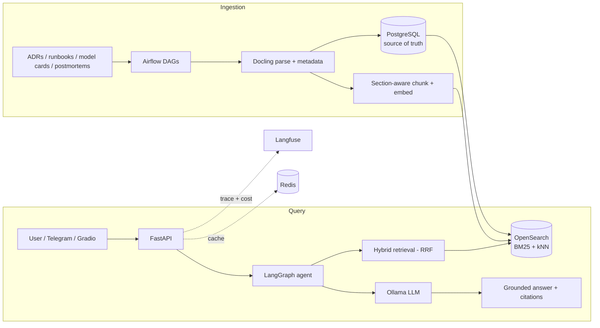

# Platform Copilot

An **agentic RAG service** that answers operational questions about an AI/ML platform —
grounded in its ADRs, runbooks, model cards, and incident postmortems, with citations.

Ask it:

> - *"Why did we choose OpenSearch over pgvector for retrieval?"*
> - *"What's the promotion-gate policy for the demand forecaster?"*
> - *"Which runbook covers a drift alert on the hourly model, and what are the first three steps?"*

…and get a grounded answer that cites the exact document and section, in a few hundred
milliseconds, with the whole call traced and costed.

Companion to [`ai-workload-platform`](../ai-workload-platform) — this is the copilot for
that platform's operational knowledge.

## Why this exists

Operational knowledge on a platform is scattered across ADRs, runbooks, model cards, dashboards,
and postmortems. On-call engineers and new joiners burn hours hunting for it. This service turns
that corpus into a **queryable, cited, low-latency assistant** — and treats the production
concerns (retrieval quality, observability, cost, caching, guardrails, and evaluation) as
first-class, not afterthoughts.

The design deliberately builds a **strong keyword-search baseline first**, then layers semantic
and agentic capabilities on top only where they measurably help. See
[`docs/adr/0001-agentic-rag-architecture.md`](docs/adr/0001-agentic-rag-architecture.md).

## Architecture



The agent (LangGraph) wraps retrieval in a state machine: **guardrail** (is this an ops
question?) → **retrieve** → **grade** documents for relevance → **rewrite** the query
(symptom → component) → **retry** up to N times → **answer or escalate**.

## Tech stack

| Layer | Choice |
|---|---|
| API | FastAPI, Python 3.12 |
| Stores | PostgreSQL 16 (metadata, source of truth), OpenSearch 2.19 (BM25 + kNN) |
| Ingestion | Apache Airflow, Docling (PDF/HTML/Markdown parsing) |
| Retrieval | BM25 + dense embeddings, fused with Reciprocal Rank Fusion |
| LLM | Ollama (local-first, provider-swappable) |
| Agent | LangGraph |
| Observability | Langfuse (tracing + cost) |
| Caching | Redis (semantic cache) |
| Interfaces | Gradio (chat), Telegram bot (on-call) |
| Tooling | UV, Ruff, MyPy, Pytest, Docker Compose |

## Roadmap

Built as progressive milestones — each one ships a working slice and proves a distinct skill.

| Milestone | What ships | Skill it proves |
|---|---|---|
| **M0** Foundation | Compose (Postgres, OpenSearch, Redis, Ollama), FastAPI health, lint/type/test wired, ADR-0001 | Reproducible platform, one-command up |
| **M1** Ingestion | Airflow DAG ingesting docs → Docling parse → metadata in Postgres; idempotent + deduped | Robust real-world ingestion |
| **M2** Keyword baseline | OpenSearch index design, BM25, Query DSL, filters + a retrieval eval harness (recall@k) | Measured baseline before adding ML |
| **M3** Hybrid search | Section-aware chunking, embeddings, RRF; eval hybrid vs BM25 vs vector | Retrieval-quality engineering |
| **M4** RAG | Ollama, grounded answers + citations, SSE streaming, Gradio UI | Grounding + hallucination control |
| **M5** Production | Langfuse tracing, Redis semantic cache, cost/latency dashboards, evals in CI | Observability + FinOps + reliability |
| **M6** Agentic | LangGraph state machine (guardrail → grade → rewrite → retry), Telegram bot | Knowing when agency earns its complexity |
| **M7** Platform integration | Ingest the live platform's drift/monitoring alerts + model cards; k8s manifests; SLOs; ADRs | Systems integration at platform scope |

## Corpus

Two sources, both real:

1. **The platform's own docs** — ADRs, runbooks, model cards, and drift reports from
   `ai-workload-platform` (a seed set is copied into `corpus/` so the repo is self-contained).
2. **Public SRE postmortems** — to exercise the ingestion pipeline against messy external
   HTML/PDF and give the copilot breadth.

## Quickstart

```bash
# 1. Bring up the data plane
docker compose up -d

# 2. Install deps (UV) and run the API
uv sync
uv run uvicorn platform_copilot.main:app --reload

# 3. Verify
curl localhost:8000/health        # -> {"status": "ok"}
uv run pytest                      # M0 test suite is green
```

Requires Docker Desktop, Python 3.12+, and the [UV](https://docs.astral.sh/uv/) package manager.

## Repository layout

```
platform-copilot/
├── src/platform_copilot/
│   ├── routers/        # FastAPI endpoints (health, search, ask)
│   ├── services/       # opensearch / ollama / agents / embeddings / cache / telegram
│   ├── models/         # SQLAlchemy models
│   ├── schemas/        # Pydantic schemas
│   ├── config.py       # Settings (pydantic-settings)
│   └── main.py         # App factory
├── airflow/            # Ingestion DAGs (M1+)
├── corpus/             # Seed documents to ingest
├── docs/adr/           # Architecture Decision Records
├── tests/
├── compose.yml
└── pyproject.toml
```

## Design decisions

Every non-obvious choice is recorded as an ADR in [`docs/adr/`](docs/adr/). Start with
[0001 — Agentic RAG architecture](docs/adr/0001-agentic-rag-architecture.md).

## Status

**Live-verified end-to-end** — Docker Postgres + OpenSearch + Redis with a local Ollama
(`llama3.2:1b`): `scripts/ingest.py` loads the corpus, and `scripts/ask.py` returns a grounded,
cited answer that ranks the runbook's *First steps* section as `[1]`. The real OpenSearch/Ollama
clients run against the stack (a first live run also surfaced and fixed an `opensearch-py`
keyword-arg bug — the value of actually running it). The HTTP API serves too — `GET /health`,
`POST /search`, and `POST /ask` all return real results under uvicorn.

Honest status — **33 tests green, all runnable without Docker:**

- **M0 foundation** — FastAPI app, health endpoint, settings, Docker Compose stack.
- **M1 ingestion** — Markdown + HTML parsers → normalized docs; idempotent SQLAlchemy
  document/chunk store (SQLite-tested, Postgres-ready), plus a scheduled Airflow DAG in
  [`airflow/dags/`](airflow/dags/) wrapping the same idempotent ingest path.
- **M2 / M3 retrieval** — section-aware chunking, BM25 + kNN query builders, index mapping,
  RRF fusion, recall@k / MRR eval, embeddings interface; the `HybridRetriever` runs both arms
  and fuses them.
- **M4 RAG** — grounded prompt + citations, the `RagPipeline`, and the `/search` + `/ask`
  endpoints. The full **retrieve → fuse → prompt → generate → cite** flow is unit-tested with
  in-memory fakes.
- **M6 agent** — a LangGraph state machine (guardrail → retrieve → grade → rewrite → retry →
  generate). Guardrail refusal, relevance grading, and the rewrite-retry loop are unit-tested by
  driving the graph with a scripted fake LLM.
- **M5 hardening** — a Redis cache (identical questions skip retrieval + the LLM) and an
  observability wrapper (per-query latency / retrieval size / response size), layered
  `Observed → Cached → RAG`; both tested with in-memory fakes.

The real OpenSearch, Ollama, Jina, Redis, and Langfuse clients are written behind interfaces and
ready to plug in; they run against the live stack and are marked `INTEGRATION-ONLY` in the source
(not exercised by the offline tests). **Remaining:** live Langfuse tracing, the Gradio UI, the Telegram
bot, and Kubernetes manifests. The agent is built and tested; making it the default `/ask` engine
is a config flip once the live LLM is in.

Nothing is mocked to look further along than it is.
